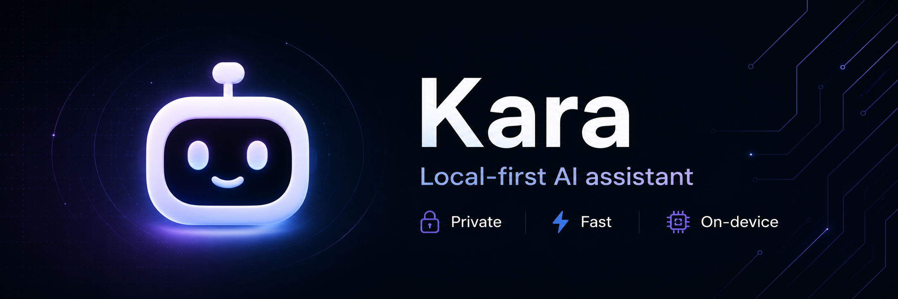

# Kara - Local-First AI Assistant 🚀



> **Privacy without compromise.** A flexible AI assistant that puts you in control. Process data locally by default, connect from anywhere.

[](LICENSE)
[](https://github.com/authuser-dev/karacron)
[](https://github.com/authuser-dev/karacron)

---

## 🎯 What is Kara?

Kara is a **flexible, local-first AI assistant** that gives you total control. By default, everything processes locally on your server, preserving maximum privacy. Unlike cloud-only solutions, **you decide the architecture** — fully local, hybrid, or connect from anywhere via desktop application.

Built for:

- **Enterprises & mid-size companies** that need flexibility without sacrificing privacy
- **SMEs** that want AI without expensive external service dependencies
- **Regular users** who want to use AI without technical knowledge

---

## ✨ Key Features

### 🔒 **Privacy First**

- 100% local processing - your data never leaves your control
- GDPR, HIPAA, and data protection regulation compliant
- Complete data audit: you control what's processed and where

### 💬 **Connect from Anywhere**

- Desktop application (Windows, macOS, Linux)
- Communicate via **Telegram, Discord, Slack**, or any integrated channel
- Write or speak: supports text input and voice processing
- Access Kara from your phone, laptop, tablet - anywhere
- **No browser required** - native desktop app with integrated messaging

### ⚡ **Optimized Performance**

- Local execution with minimal latency
- GPU acceleration support (NVIDIA, AMD, Apple Silicon)
- Scalable from laptops to enterprise servers
- Instant response times (no network delays)

### 🔌 **Flexible & Disconnected**

- **Full offline mode**: works without internet
- **Cloud optional**: integrate Azure AI, AWS Bedrock, OpenAI if needed
- **No vendor lock-in**: choose local models or cloud services per task
- **No subscriptions**: one-time setup, no monthly fees for local mode

### 🧠 **Modern AI Models**

- Support for multiple open-source LLMs
- Easy integration of new models
- Automatic optimization based on available resources

### 📊 **Analysis & Generation**

- Document and text analysis
- Content generation
- Context-based answers from your documents
- Multi-language support
- Voice-to-text and text-to-speech capabilities

---

## 🚀 System Requirements

### Minimum Requirements

- **Operating System:** Linux, macOS (Intel or Apple Silicon), or Windows
- **RAM:** 8GB minimum (16GB recommended for best experience)
- **Disk Space:** 50GB+ for models and data
- **GPU (Optional):** NVIDIA CUDA, AMD ROCm, or Metal (Apple Silicon)

### Recommended Setup

- **Operating System:** Latest version of macOS, Windows 11, or Ubuntu 22.04+
- **RAM:** 16GB or more
- **Processor:** Modern multi-core CPU
- **Disk:** SSD with 100GB+ space (faster model loading)
- **GPU:** Any modern GPU for 5-10x faster processing
- **Network:** Optional (only if using cloud providers like Azure/AWS)

### Supported Platforms

- ✅ macOS 11.0+ (Intel & Apple Silicon)
- ✅ Windows 10/11 (64-bit)
- ✅ Ubuntu 20.04+ & Debian 11+
- ✅ Fedora 35+ & RHEL 8+
- ✅ Other Linux distributions (glibc 2.31+)

---

## 💼 Use Cases

### 🏢 For Enterprises

- ✅ Analyze sensitive data without exposure
- ✅ Process confidential internal documents
- ✅ Automatic compliance with privacy regulations
- ✅ Integration with existing enterprise workflows
- ✅ Multi-department access via secure channels

### 📱 For SMEs

- ✅ Automate repetitive tasks
- ✅ Content writing & editing assistant
- ✅ Text and data analysis
- ✅ Improved customer support (no per-query API costs)
- ✅ Team collaboration via messaging platforms

### 👤 For Individual Users

- ✅ Write and edit documents
- ✅ Creative brainstorming
- ✅ Ask questions about your documents
- ✅ Learn without cloud platform dependency
- ✅ Voice-based interactions

---

## 🔒 Security & Privacy Architecture

Kara implements multiple security layers:

```
┌───────────────────────────────────────────┐
│   Desktop App (Windows/macOS/Linux)       │
├───────────────────────────────────────────┤
│   Messaging Layer (Telegram, Discord...)  │
├───────────────────────────────────────────┤
│   Authentication & Authorization          │
├───────────────────────────────────────────┤
│   Local Server (End-to-End Encrypted)     │
├───────────────────────────────────────────┤
│   AI Models (Local GPU/CPU Processing)    │
├───────────────────────────────────────────┤
│   Encrypted Database (AES-256)            │
└───────────────────────────────────────────┘
         ➜ Never leaves your control ◀︎
```

**Security Features:**

- AES-256 encryption at rest
- TLS 1.3 for all communications
- Input validation on all interfaces
- Local audit logs
- Zero external telemetry
- Open-source architecture for transparency

See [SECURITY.md](docs/SECURITY.md) for detailed information.

---

## 💬 Communication Channels

Connect with Kara from anywhere, in any way:

### Desktop App

- **Native applications** for Windows, macOS, and Linux
- Direct access with full feature set
- Local control and instant response

### Messaging Platforms

- **Telegram** - `/ask What's in my documents?`
- **Discord** - `@Kara summarize this contract`
- **Slack** - Use Kara directly in your workspace
- **Microsoft Teams** - Integrated team collaboration
- **Custom platforms** - HTTP webhooks for integration

### Voice & Text

- **Text input** - Traditional messaging
- **Voice commands** - Speak naturally to Kara
- **Voice output** - Listen to responses
- **Multi-language** - Spanish, English, French, German, and more

### Example Interactions

```
Telegram: "Kara, translate this document to English"
Discord: "@Kara analyze my sales data"
Voice: "Hey Kara, summarize the latest email"
Desktop App: Click, type, or speak your question
```

---

## 🌐 Architecture: Local + Optional Cloud

Choose the architecture that fits your needs:

### 🏠 Local Mode (Default)

```
Your Device → Local Models → Your Data (100% Privacy)
```

- **Best for:** Maximum privacy, GDPR/HIPAA compliance, sensitive data
- **Cost:** Free API, hardware only
- **Latency:** Minimal
- **Internet:** Optional (offline-capable)

### ☁️ Cloud Mode (Optional)

```
Your Device → Azure/AWS/OpenAI → Your Data (Managed Privacy)
```

- **Best for:** Powerful models (GPT-4, Claude), minimal local setup
- **Cost:** Pay-per-use based on consumption
- **Latency:** Depends on connection
- **Internet:** Required

### 🔀 Hybrid Mode (Recommended)

```
Your Device → Intelligent Routing → Local OR Cloud per Task
```

- **Routine tasks:** Fast local models (Mistral 7B)
- **Complex tasks:** Cloud providers when needed
- **Automatic fallback:** Uses local if cloud unavailable

---

## 🆚 Feature Comparison

| Feature                | Kara | ChatGPT | Claude | OpenClaw |
| ---------------------- | ---- | ------- | ------ | -------- |
| Local-First            | ✅   | ❌      | ❌     | ✅       |
| Privacy Control        | ✅   | ❌      | ❌     | ✅       |
| Desktop App            | ✅   | ❌      | ❌     | ⚠️       |
| Messaging Integration  | ✅   | ⚠️      | ⚠️     | ⚠️       |
| Voice In/Out           | ✅   | ⚠️      | ⚠️     | ⚠️       |
| Works Offline          | ✅   | ❌      | ❌     | ✅       |
| No Monthly Fees        | ✅   | ❌      | ❌     | ✅       |
| Enterprise Ready       | ✅   | ⚠️      | ⚠️     | ✅       |
| Flexible (Local+Cloud) | ✅   | ❌      | ❌     | ❌       |
| Easy Integration       | ✅   | ⚠️      | ⚠️     | ✅       |

---

## ❓ Frequently Asked Questions

### 🌐 Do I need internet?

Not for local mode. Kara works 100% offline once installed. Cloud integration is optional.

### 📱 Can I use Kara from my phone?

Yes! Connect via Telegram, Discord, Slack, or other messaging platforms from any device. The desktop app is primary for management.

### 🎙️ Does it support voice?

Yes. Both voice input (speech-to-text) and voice output (text-to-speech) are supported in multiple languages.

### 🔐 How private is it really?

As private as you configure it:

- **Local mode:** Completely private, nothing leaves your server
- **Cloud mode:** Privacy depends on the provider
- **Hybrid mode:** You control which data goes where

See [SECURITY.md](docs/SECURITY.md) for encryption and privacy policy details.

### 💻 What are the system requirements?

- **Minimum:** 8GB RAM, 50GB disk, any modern CPU/OS
- **Recommended:** 16GB+ RAM, SSD, modern GPU (NVIDIA/AMD/Apple Silicon)
- **Works on:** macOS, Windows, Linux (all recent versions)

### 🤖 What AI models can I use?

Any open-source LLM: Mistral, LLaMA, Neural Chat, Falcon, etc. Or integrate with cloud providers (Azure, AWS, OpenAI).

### 📊 How does performance compare to ChatGPT?

- **Local:** Faster due to no network latency, adequate for 90% of tasks
- **Cloud:** Comparable power to ChatGPT but with privacy control
- **Hybrid:** Best of both worlds - speed when needed, power when necessary

### 💰 What's the cost?

- **Local:** Free (no subscriptions, no API costs)
- **Cloud providers:** Optional, pay-as-you-go
- **Support:** Community or enterprise plans (optional)

### 🔄 Can I switch between local and cloud?

Yes. Kara supports hybrid mode where you configure which tasks use which provider.

### 🏢 Is it suitable for production?

Yes. Kara is designed for enterprise environments from day one with security, compliance, and scalability baked in.

### 🌍 What languages are supported?

- LLM inference: All languages supported by the model
- UI: English, Spanish, French, German, etc.
- Voice: 40+ languages for speech-to-text and text-to-speech

---

## 📝 License

Distributed under the Apache 2.0 license. See [LICENSE](LICENSE) for details.

---

## 📞 Support & Community

- **Issues & Bugs:** [GitHub Issues](https://github.com/authuser-dev/karacron/issues)
- **Discussions:** [GitHub Discussions](https://github.com/authuser-dev/karacron/discussions)
- **Email:** sgonzalez@authuser.org
- **Documentation:** [docs.karacron.dev](https://docs.karacron.dev)
- **Discord Community:** [Join our server](https://discord.gg/karacron)

---

## 🙏 Acknowledgments

Kara is built on the vision of respecting privacy and empowering users with AI tools without compromise.

Thanks to the open-source community for incredible models like Mistral, LLaMA, Falcon, and their contributors.

---

<div align="center">

### Built with ❤️ for Privacy & Control

**[★ Star this repo](https://github.com/authuser-dev/karacron)** if Kara helps you

Privacy. Control. Simplicity.

</div>
